# Integration Health Dashboard

## 1. Project overview

The **Integration Health Dashboard** is a React and Vite MVP prototype designed to show the health of fictional software interfaces in one simple dashboard. The project is based on a realistic integration support scenario, where support engineers need to monitor interfaces, identify failures quickly and understand what action may be required.

The dashboard does not use real employer, client, production or system data. All interface records are fictional and stored as mock JSON data. This was an important design decision because the application is intended for assessment and public demonstration, not for live operational use.

### Problem statement

Integration support teams often need to check many APIs, file transfers and system interfaces during daily checks, release support or incident investigation. When interface information is spread across different tools, it can take longer to identify which interface is failing, what the current status is and what action should be taken next.

This project addresses that problem by creating a small dashboard that brings the key information into one place. The aim is not to replace a real monitoring platform, but to demonstrate how an MVP could support faster visibility of interface health.

### Proposed solution

The proposed solution is a web-based dashboard prototype with:

- summary cards showing total, healthy, warning and failed interfaces
- a table of fictional interface records
- search by interface name
- filtering by status
- a details panel for a selected interface
- empty state handling when no records match
- automated tests for core utility logic
- CI pipeline and production deployment

### Target user

The target user is an integration support engineer or live service engineer. This user needs a fast and clear overview of interface health, especially during daily checks, incident investigation or release support. The design therefore focuses on clarity, simple navigation and quick access to failed or warning records.

### MVP scope

The MVP includes front-end functionality, mock data, documentation, tests, CI and deployment. It does not include a backend, authentication, live monitoring integration, real endpoint URLs, real logs or confidential operational data.

## 2. Requirements

The requirements were defined from the perspective of a support user who needs to understand interface health quickly. The MVP scope was kept intentionally limited so the project could be completed within the assessment timeframe.

### Functional requirements

| ID  | Requirement                                                          | Priority    |
| --- | -------------------------------------------------------------------- | ----------- |
| FR1 | Show summary cards for total, healthy, warning and failed interfaces | Must have   |
| FR2 | Show a table of mock interface records                               | Must have   |
| FR3 | Search interfaces by name                                            | Must have   |
| FR4 | Filter interfaces by status                                          | Must have   |
| FR5 | Select an interface and view details                                 | Must have   |
| FR6 | Show an empty state when no records match                            | Should have |
| FR7 | Clear search, filter and selected interface                          | Should have |

### Non-functional requirements

| ID   | Requirement                                                             | Priority    |
| ---- | ----------------------------------------------------------------------- | ----------- |
| NFR1 | The dashboard should be simple, readable and easy to understand         | Must have   |
| NFR2 | Controls should have clear labels and support keyboard use              | Must have   |
| NFR3 | The project must use fictional data only                                | Must have   |
| NFR4 | Code should be organised into reusable components and utility functions | Must have   |
| NFR5 | Core logic should be covered by automated tests                         | Must have   |
| NFR6 | The application should be deployable to a production environment        | Must have   |
| NFR7 | The MVP should load quickly with the small mock dataset                 | Should have |

### Assumptions

The application uses local mock JSON data only. It is designed for assessment, demonstration and learning purposes. The first version does not require user authentication because all data is fictional and the dashboard is not connected to a real service.

### Constraints

The project must remain small enough to complete within the available timeframe. It must include a user interface, documentation, automated testing and evidence of a CI/CD workflow. It must not include real client information, real interface names, endpoint URLs, production logs or other confidential data.

### Acceptance criteria

The MVP is considered complete when the user can view the dashboard summary, review the interface table, search by interface name, filter by status and open the details panel for a selected record. The project must also use fictional data only, include automated tests for the core logic, run through a CI pipeline and be available through a production deployment.

These acceptance criteria were useful because they kept the project focused. They also made it easier to decide when a feature was complete and when it should be moved to `Done` on the Kanban board.

### Risks and mitigation

| Risk                          | Impact                               | Mitigation                                                            |
| ----------------------------- | ------------------------------------ | --------------------------------------------------------------------- |
| Scope becomes too large       | The MVP may not be completed on time | Limit the first version to summary, table, search, filter and details |
| Sensitive information is used | Confidentiality or security risk     | Use fictional mock data only                                          |
| Testing is added too late     | TDD evidence may be weak             | Write tests for utility functions during implementation               |
| Deployment issues occur       | Production evidence may be delayed   | Use a simple GitHub Pages deployment                                  |
| UI becomes difficult to use   | User goal may not be met             | Keep the layout simple and add basic accessibility checks             |

## 3. Planning and Kanban

The project was managed using a Kanban workflow in GitHub Projects. Kanban was suitable because the MVP was small, iterative and delivered through separate issues, branches and pull requests.

### Kanban workflow

| Column      | Purpose                                             |
| ----------- | --------------------------------------------------- |
| Backlog     | Tasks identified for the MVP but not ready to start |
| To Do       | Tasks ready for development                         |
| In Progress | Work currently being completed                      |
| In Review   | Work linked to a pull request or waiting for review |
| Done        | Completed tasks                                     |

The main milestone was **MVP v1.0**. This milestone covered the first working version of the dashboard, including mock data, core UI features, automated tests, CI/CD, deployment and documentation.

### Planned issues

The main GitHub issues covered:

- project setup
- mock interface data
- status summary logic and tests
- summary cards
- interface table
- search functionality and tests
- status filtering and tests
- details panel
- accessibility and usability improvements
- CI pipeline
- production deployment
- README documentation

Each ticket included a label and acceptance criteria. This helped make the work traceable and gave each task a clear definition of completion. For example, feature tickets used labels such as `feature`, testing tickets used `testing` or `tdd`, and deployment work used labels such as `deployment` or `ci-cd`.

### Development workflow

The development process followed these steps:

1. Select a GitHub issue.
2. Move the issue to `In Progress`.
3. Create a feature branch from `main`.
4. Implement the change.
5. Commit and push the branch.
6. Open a pull request.
7. Move the issue to `In Review`.
8. Merge the pull request after checking the changes.
9. Move the issue to `Done`.

This workflow helped show that the MVP was developed incrementally rather than as one single large change.

### Ticket review

The project tickets were reviewed to check that the main tasks had both labels and acceptance criteria. This was included because the assessment requires evidence that project work was planned and tracked properly. Labels made the type of work visible, while acceptance criteria explained what had to be true before a task could be treated as complete.

| Ticket area          | Example labels    | Acceptance criteria included |
| -------------------- | ----------------- | ---------------------------- |
| Project setup        | setup, feature    | Yes                          |
| Mock data            | data, feature     | Yes                          |
| TDD and tests        | testing, tdd      | Yes                          |
| Dashboard features   | feature           | Yes                          |
| Accessibility and UX | accessibility, ux | Yes                          |
| CI pipeline          | ci-cd, testing    | Yes                          |
| Deployment           | deployment, ci-cd | Yes                          |
| Documentation        | documentation     | Yes                          |

This gave the project better traceability because the final dashboard features can be linked back to planned work items.

### Kanban board evidence

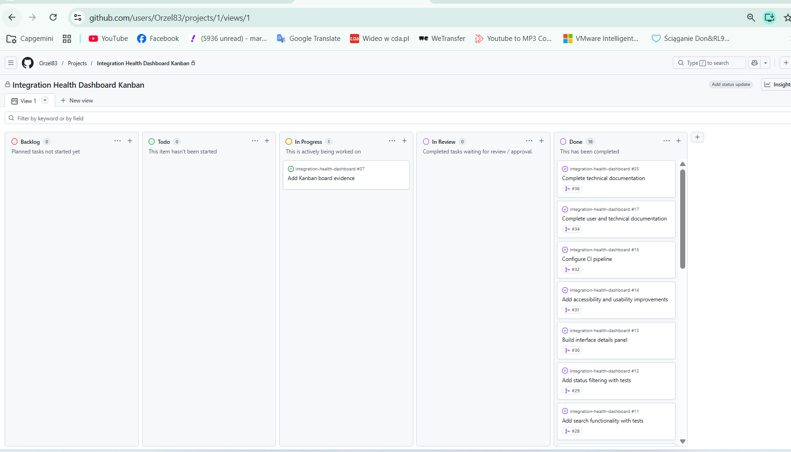

## 4. UX design and prototype

The UX design was created before implementation to reduce the risk of building an unclear interface. The prototype focused on the main workflow of a support user who needs to identify failed or warning interfaces quickly.

### User goal

The main user goal is to understand the current interface health position, find a specific interface if needed and view basic operational details about a selected item.

### User flow

1. The user opens the dashboard.
2. The user reviews the summary cards.
3. The user searches or filters the interface list.
4. The user selects an interface.
5. The user reviews status, error message and suggested action.
6. The user clears the selection or filters when finished.

### Prototype screens

| Screen             | Purpose                                           |
| ------------------ | ------------------------------------------------- |
| Dashboard Overview | Shows summary cards, search, filter and table     |
| Interface Details  | Shows more information about a selected interface |
| Empty State        | Shows a message when no records match             |

Figma prototype:

```text
https://www.figma.com/design/3skk9jFy2yVn7iiYblW9qp/Integration-Health-Dashboard-UX-Prototype?node-id=2-3&t=3JpahDibAjDNBErg-1
```

### UX design decisions

Summary cards were placed at the top because they give the fastest overview of the dashboard state. The search input and status filter were placed above the table because both controls affect the visible records. The details panel was kept simple so the selected interface information is easy to read.

The prototype avoided real employer or client data. This made the design suitable for public evidence and ensured that the project stayed within confidentiality boundaries.

### Prototype evidence

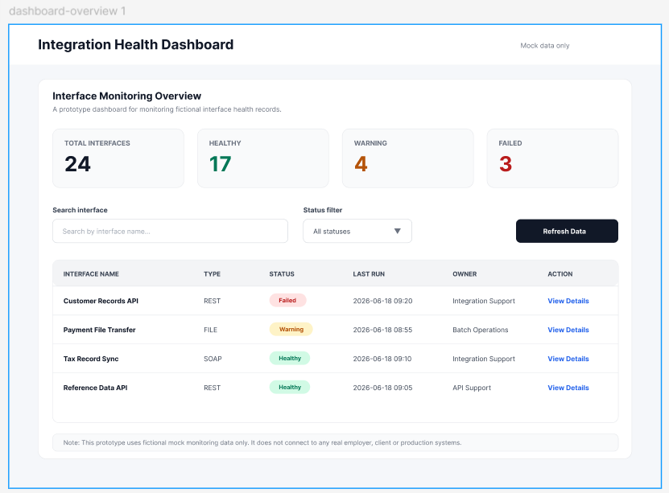

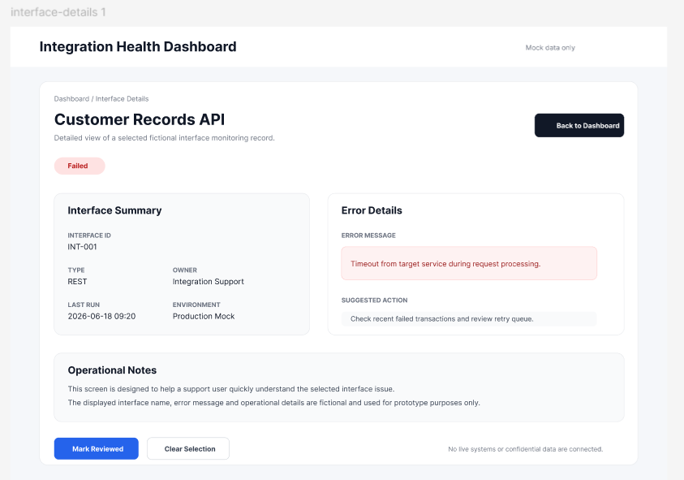

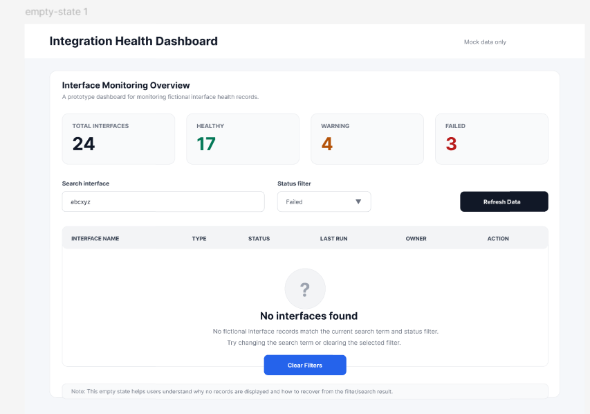

## 5. Technical implementation

The project was built as a React application using Vite. React was selected because it supports reusable components, while Vite provides a fast development server and a simple production build process.

### Technology stack

| Technology     | Purpose                                          |
| -------------- | ------------------------------------------------ |
| React          | Builds the user interface                        |
| Vite           | Provides development server and production build |
| JavaScript     | Implements application logic                     |
| CSS            | Styles the dashboard                             |
| JSON           | Stores fictional mock data                       |
| Vitest         | Runs automated tests                             |
| GitHub         | Hosts source code, issues and pull requests      |
| GitHub Actions | Runs the CI pipeline                             |
| GitHub Pages   | Hosts the production deployment                  |

### Project structure

```text
integration-health-dashboard/
  .github/workflows/ci.yml
  docs/images/
  src/
    components/
      InterfaceDetails.jsx
      InterfaceTable.jsx
      SummaryCard.jsx
    data/
      mockInterfaces.json
    tests/
      interfaceUtils.test.js
    utils/
      interfaceUtils.js
    App.css
    App.jsx
    index.css
    main.jsx
  package.json
  vite.config.js
  README.md
```

### Mock data

The mock interface data is stored in:

```text
src/data/mockInterfaces.json
```

Each record contains a fictional interface ID, name, type, status, last run time, owner, environment, error message and suggested action. The use of mock data was a key security and confidentiality decision. It allowed the dashboard to demonstrate realistic behaviour without exposing real operational details.

### Component approach

The application was split into small components to keep the code easier to understand and maintain. The `SummaryCard` component is used for the dashboard cards, the `InterfaceTable` component renders the mock records, and the `InterfaceDetails` component shows the selected interface information. Keeping these parts separate made the project easier to build in stages.

Utility logic was also separated into `interfaceUtils.js`. This allowed the status summary, search and filter behaviour to be tested independently from the React components. This was helpful because the same logic can be reused by the UI without mixing business logic directly into the display code.

## 6. Main features

### Summary cards

The dashboard displays four summary cards: total interfaces, healthy, warning and failed. The counts are calculated using the `getStatusSummary` utility function. This gives the user a quick view of the overall monitoring position.

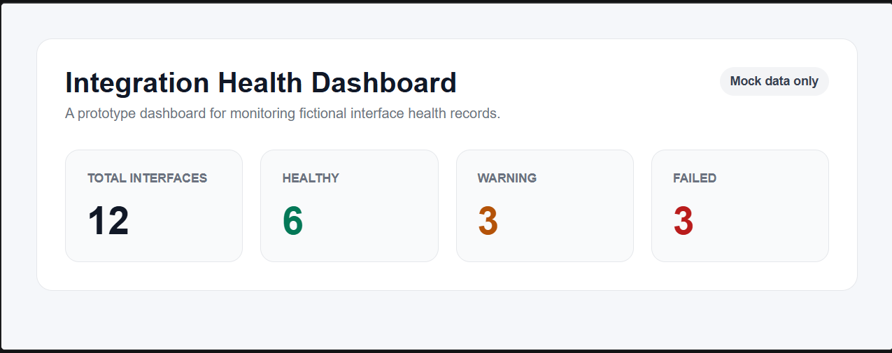

### Interface table

The `InterfaceTable` component displays the fictional interface records. It shows interface name, type, status, last run time and owner. Status values are displayed as badges so failed and warning records are easier to identify.

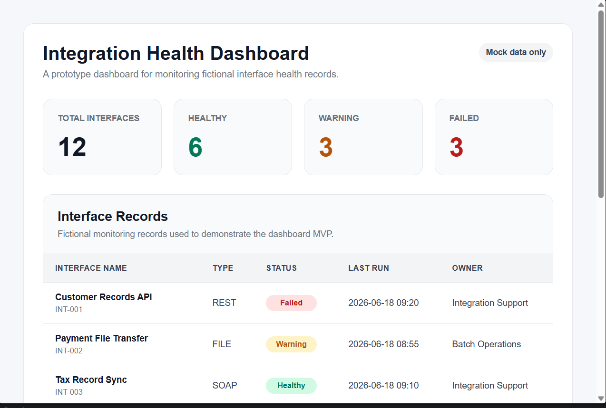

### Search functionality

The user can search by interface name. The search is case-insensitive and is handled by the `searchInterfaces` utility function. This helps a support user find a specific interface quickly during checks or investigation.

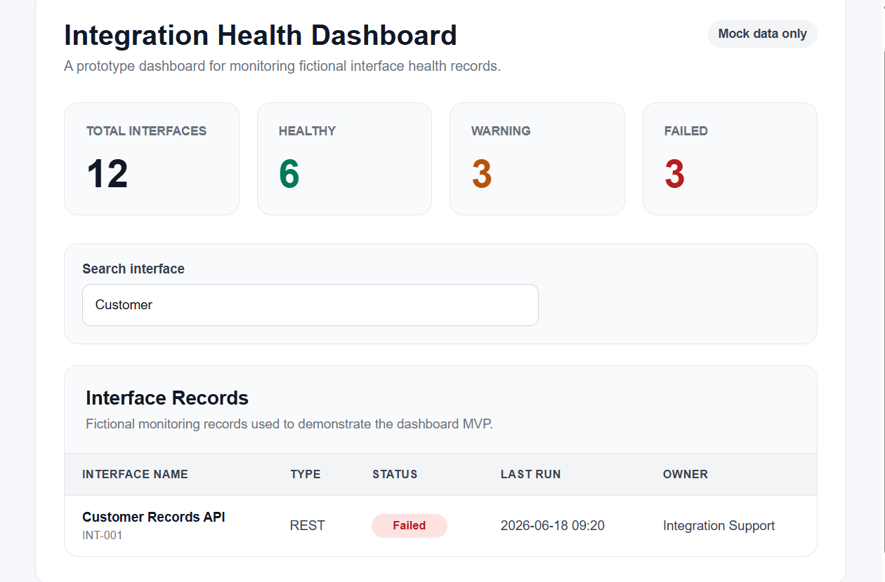

### Status filtering

The user can filter records by status: All statuses, Healthy, Warning or Failed. The filter works together with search, so the user can narrow the table results in more than one way.

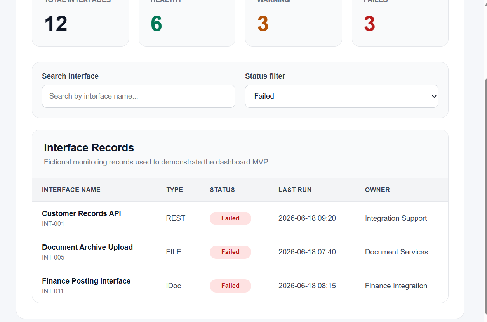

### Details panel

The user can click **View Details** to show more information about a selected interface. The details panel includes the interface ID, type, status, last run, owner, environment, error message and suggested action.

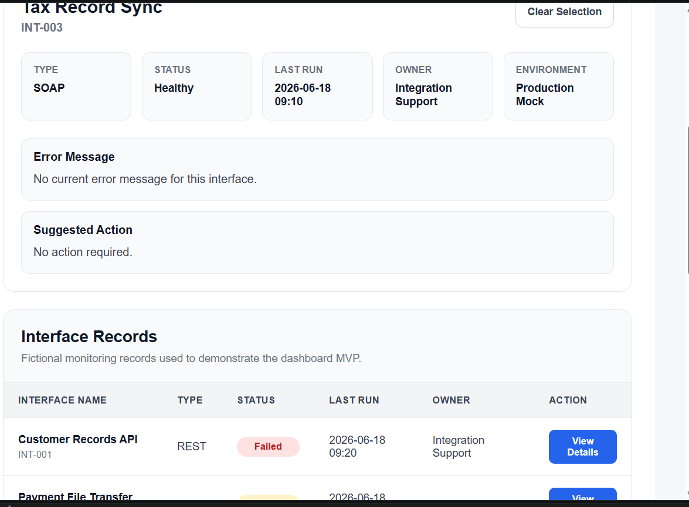

### Empty state

If no records match the search and filter, the dashboard displays a clear empty state message. A clear filters action helps the user recover without needing to refresh the page.

### Data safety decision

A key design decision was to avoid real operational examples. Even though the project is based on a realistic integration support scenario, the records, owners, environments, error messages and suggested actions are fictional. This reduces confidentiality risk and makes the repository suitable for review.

In a workplace version, access control and data protection would need to be considered more carefully. For this assessment version, the safest approach was to use mock records and clearly document that no real data is included.

## 7. Accessibility and usability

The MVP includes basic accessibility and usability improvements. These are small changes, but they make the dashboard clearer and easier to use.

| Improvement           | Purpose                                        |
| --------------------- | ---------------------------------------------- |
| Visible labels        | Makes search and filter controls clear         |
| Table caption         | Gives context for the interface table          |
| Keyboard focus styles | Helps keyboard users see the active control    |
| Results count         | Shows how many records are displayed           |
| `aria-live` region    | Announces result count updates                 |
| Clear filter button   | Helps the user recover from no-result searches |

Manual checks confirmed that the search input had a visible label, the status filter had a visible label, keyboard navigation worked, focus styles were clear and the empty state was understandable.

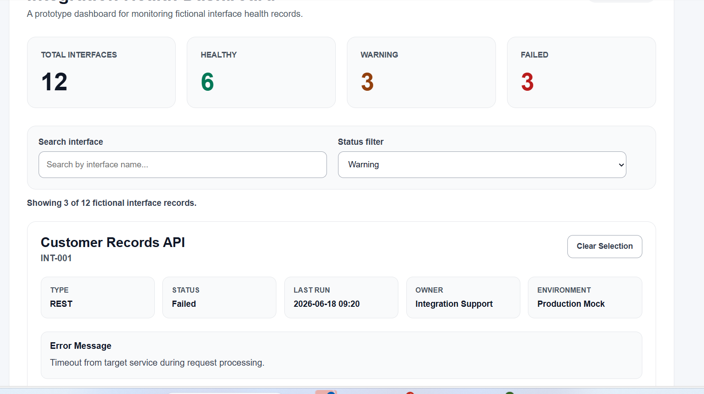

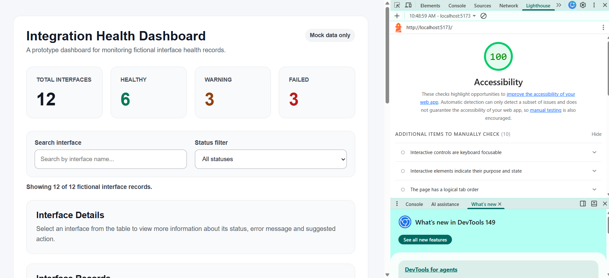

## 8. TDD and automated testing

The project uses Vitest to test the main utility logic. This keeps important behaviour separate from the UI and makes the code easier to maintain.

### TDD approach

A small Test Driven Development approach was used for the utility functions. Expected behaviour was written as tests before the final logic was completed. This was useful because the dashboard depends on correct counting, searching and filtering.

### Tested functions

| Function                   | Test coverage                                                       |
| -------------------------- | ------------------------------------------------------------------- |
| `getStatusSummary`         | Empty list, mixed statuses and unknown statuses                     |
| `searchInterfaces`         | Empty search, matching search, case-insensitive search and no match |
| `filterInterfacesByStatus` | All, Healthy, Warning, Failed and unknown status                    |

### Running tests

```bash
npm test
```

To run tests once without watch mode:

```bash
npm test -- --run
```

### Test evidence

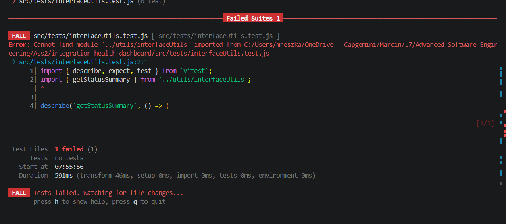

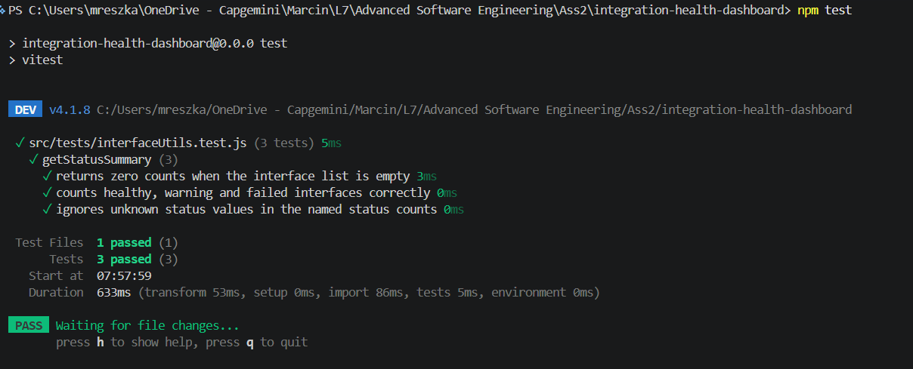

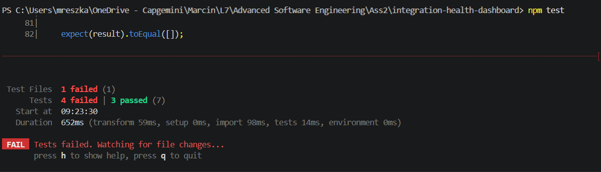

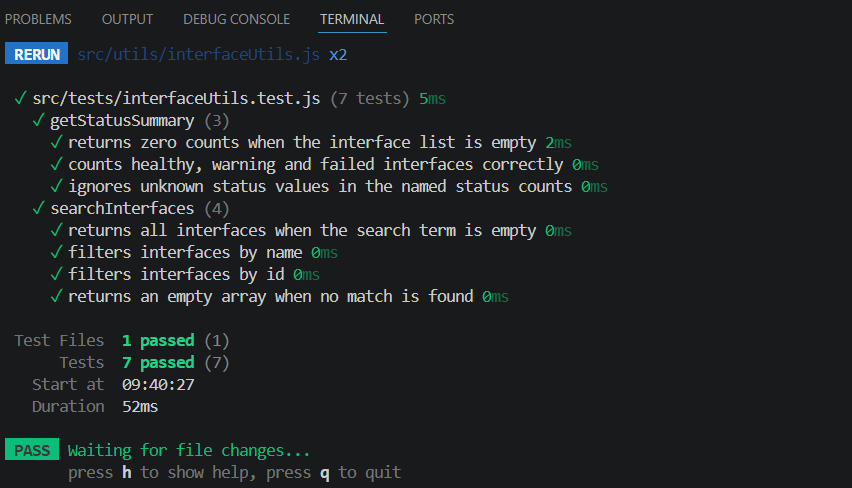

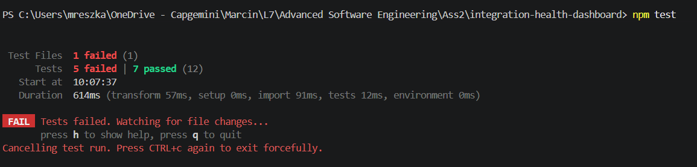

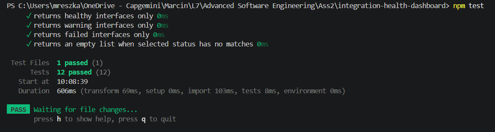

## 9. CI pipeline

A GitHub Actions CI pipeline was added to automatically check the project when code is pushed or a pull request is opened against the `main` branch.

The workflow file is stored in:

```text
.github/workflows/ci.yml
```

The pipeline runs:

```bash
npm ci
npm test -- --run
npm run build
```

This confirms that dependencies install correctly, automated tests pass and the production build can be created. The pipeline is intentionally simple because this is a small front-end MVP, but it still demonstrates an important engineering practice: changes should be checked automatically before they are accepted.

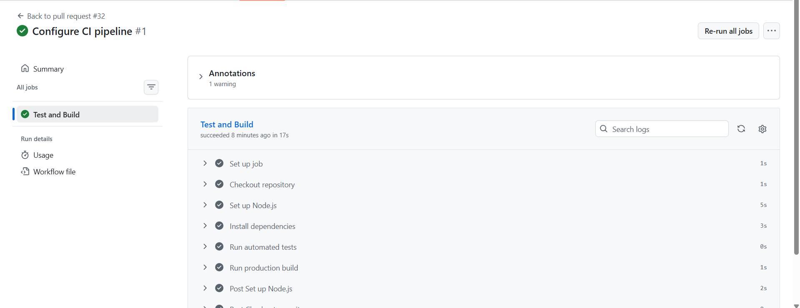

## 10. Production deployment

The MVP was deployed to GitHub Pages.

Production URL:

```text
https://orzel83.github.io/integration-health-dashboard/
```

GitHub Pages was suitable because the MVP is a static front-end application and does not require a backend, database or authentication.

The deployment uses:

| Item               | Value        |
| ------------------ | ------------ |
| Build tool         | Vite         |
| Deployment package | gh-pages     |
| Build output       | dist         |
| Deployment branch  | gh-pages     |
| Platform           | GitHub Pages |

Deployment command:

```bash
npm run deploy
```

The Vite configuration includes the base path for GitHub Pages:

```javascript
base: "/integration-health-dashboard/";
```

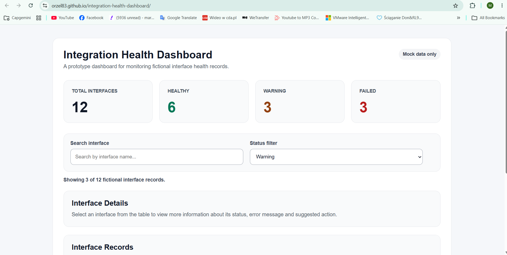

### Configuration notes

The deployment required the correct Vite base path. Without this configuration, the deployed page can appear blank because GitHub Pages serves the application from the repository path rather than the domain root. The base value must match the repository name:

```javascript
base: "/integration-health-dashboard/";
```

This configuration is important because it allows the built JavaScript and CSS assets to load correctly in the production environment.

## 11. User documentation

Users can access the deployed dashboard through the production URL. When the dashboard opens, the user can review the summary cards, search for an interface, filter by status and select **View Details** to inspect a record.

A typical user workflow is:

1. Open the dashboard.
2. Review the summary cards.
3. Filter to show failed or warning records.
4. Search for a specific interface if needed.
5. Select **View Details**.
6. Review the error message and suggested action.
7. Clear the selection or filters when finished.

The dashboard uses fictional data only. It does not show real system logs, endpoint URLs, production records, client data or employer data.

## 12. Developer documentation

### Local setup

```bash
git clone https://github.com/Orzel83/integration-health-dashboard
cd integration-health-dashboard
npm install
```

### Run locally

```bash
npm run dev
```

Vite usually provides this local URL:

```text
http://localhost:5173/
```

### Run tests

```bash
npm test
```

### Build for production

```bash
npm run build
```

### Preview production build

```bash
npm run preview
```

## 13. Known limitations

| Limitation            | Explanation                                         |
| --------------------- | --------------------------------------------------- |
| Static mock data      | Data does not update in real time                   |
| No backend            | The app cannot retrieve live monitoring data        |
| No authentication     | All users see the same prototype                    |
| No persistent state   | Filters and selection reset after refresh           |
| Limited test coverage | Tests focus on utility logic, not full UI rendering |

These limitations are acceptable for the MVP because the purpose of the project is to demonstrate planning, design, implementation, testing, CI/CD, deployment and documentation.

## 14. Evaluation and Reflection

This section evaluates the Integration Health Dashboard MVP and reflects on the software engineering process used to design, build, test and deploy the prototype.

The project achieved its main aim of creating a small front-end dashboard that can display fictional interface monitoring records, support basic investigation workflows and demonstrate software engineering practices such as requirements definition, UX prototyping, Kanban planning, TDD, automated testing, CI and production deployment.

### 14.1 What Went Well

One of the strongest parts of the project was that the MVP had a clear and realistic purpose from the beginning. The dashboard idea was closely linked to a real support environment, but the implementation avoided any real employer, client or production data. This made the project practical while still keeping it safe for assessment and public demonstration.

The use of mock data worked well because it allowed the dashboard features to be developed without needing a backend or live system connection. The fictional dataset was enough to support summary cards, the interface table, search, status filtering and the details panel.

The Kanban board and GitHub issues also helped keep the work organised. Splitting the work into smaller tickets made the project easier to manage and provided a clear record of how the MVP developed over time. Using labels, acceptance criteria, branches and pull requests made the workflow more controlled than simply committing everything directly to the main branch.

The TDD approach worked well for the utility logic. Functions such as `getStatusSummary`, `searchInterfaces` and `filterInterfacesByStatus` were suitable for testing because they have clear input and output. This made it easier to prove that key dashboard logic behaved as expected before being connected to the UI.

The CI pipeline was another successful part of the project. GitHub Actions helped automate the test and build process, which improved confidence that new changes did not break the application before being merged.

### 14.2 What Was Difficult

One difficulty was keeping the MVP small enough. It would have been easy to keep adding more features, such as live data, authentication, alert history or user roles. However, adding too much would have increased the risk of not completing the project properly. The scope had to stay focused on the core monitoring workflow.

Another challenge was maintaining the README as the project grew. Because the assessment report is written as README documentation, each stage needed to be documented clearly. This became quite large over time, so the final cleanup stage was important to check structure, links, screenshots and consistency.

The GitHub Pages deployment also required careful configuration. Because Vite applications need the correct `base` path when deployed to a repository subpath, the deployment could show a blank page if this setting was wrong. This was a useful reminder that deployment configuration is part of software engineering, not just a final technical step.

Capturing evidence was also time-consuming. Screenshots for tests, UI states, CI, deployment and Kanban planning were useful, but they needed to be saved in the correct folder and linked correctly in the README. This helped the report, but it added extra process work.

### 14.3 Limitations of the MVP

The MVP has several limitations.

| Limitation           | Explanation                                                                          |
| -------------------- | ------------------------------------------------------------------------------------ |
| Static mock data     | The dashboard does not connect to live monitoring tools or real APIs                 |
| No backend           | There is no server-side logic, database or API integration                           |
| No authentication    | The prototype does not support users, roles or permissions                           |
| No real-time updates | Interface statuses only change if the mock data file is edited                       |
| Limited UI testing   | Automated tests focus on utility logic rather than full component rendering          |
| No incident workflow | The dashboard shows suggested actions but does not create or update incident records |
| No persistent state  | Search, filters and selected interface reset when the page refreshes                 |

These limitations are acceptable for the MVP because the purpose of the project was to demonstrate a controlled software engineering process and a working front-end prototype, not to build a production monitoring platform.

### 14.4 Lessons Learned

A key lesson from this project is that defining the scope early helps prevent unnecessary complexity. The project became easier to manage once the MVP was limited to summary cards, search, filtering, table display and a details panel.

Another lesson is that mock data can be useful when building early prototypes. It allows the user interface and logic to be tested without waiting for real integrations or exposing sensitive data. This is especially important in environments where production data and system details must be protected.

The project also showed that TDD is easier to apply when logic is separated from the UI. By keeping functions such as status counting, searching and filtering in `interfaceUtils.js`, they could be tested independently from React components.

The workflow also reinforced the value of small pull requests. Smaller changes were easier to review, document and connect to issues. This made the development history clearer and supported better traceability.

### 14.5 Future Improvements

If the MVP was developed further, the next improvements could include:

| Improvement           | Reason                                                              |
| --------------------- | ------------------------------------------------------------------- |
| Live API integration  | To retrieve real monitoring data from an approved and secure source |
| Authentication        | To control who can access the dashboard                             |
| Role-based access     | To show different information depending on user responsibility      |
| Real-time refresh     | To keep interface status information up to date                     |
| Incident links        | To connect failed interfaces to support tickets or incident records |
| More detailed testing | To add React component tests and end-to-end tests                   |
| Export function       | To allow users to export filtered results                           |
| Alert history         | To show whether an interface has repeated failures over time        |

These improvements were not included in the MVP because they would increase complexity and could introduce security, confidentiality and data protection concerns.

### 14.6 Final Reflection

Overall, the project was successful as a small software engineering MVP. It produced a working dashboard, a UX prototype, a planned development workflow, automated tests, CI, deployment and user and technical documentation.

The most valuable part of the project was not only building the interface, but showing the complete process behind it. The project demonstrates that even a small prototype benefits from requirements, planning, testing, accessibility checks, documentation and deployment.

The final MVP is not a complete production monitoring tool, but it provides a realistic foundation for one. It shows how an integration support dashboard could help users identify failed or warning interfaces more quickly while keeping the prototype safe by using fictional data only.
